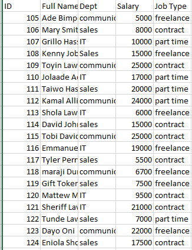
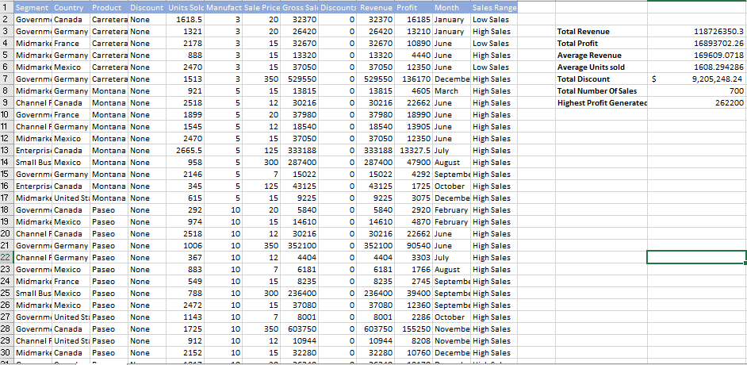

# Employees Table

## Introduction
 worksheet 1, create a table with 20 rows of information having the fields below: 
Employee ID
Employee Full Name
Department (Communications, Sales, I.T)
Salary (between $5000 to $25000)
Job type (Part-time, Freelance, Contract)

## Question
Show only employees who are ‘Freelancers’ and highlight the ones whose salaries are above $10000
split the employees’ full names into first name and last name. Check for duplicates and highlight if any (do not delete)

Adjusted model

##Sales Data

##Task 2

The total Revenue and Profit generated
The average Revenue and Units Sold for every order
The total Discount given in $
Total number of sales recorded
The highest Profit generated
Create a column named ‘Sales Range’, return ‘High Sales’ if the Sales value is above average, otherwise, return ‘Low Sales’.

##Task 3

Using the Sales Data, 
Calculate:
The average revenue generated from each sale of ‘Paseo’
The number of sales made in the Government and Midmarket segment
The total revenue generated from the sales of ‘Montana’ in Canada
In which Country, Segment and Month was the highest unit of goods sold?
What is the total profit made in December

