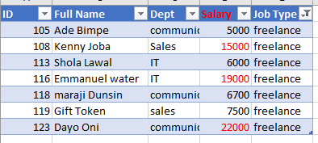
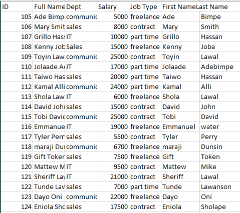

# Employees Table

## Introduction
 worksheet 1, create a table with 20 rows of information having the fields below: 
Employee ID
Employee Full Name
Department (Communications, Sales, I.T)
Salary (between $5000 to $25000)
Job type (Part-time, Freelance, Contract)

## Question
Show only employees who are ‘Freelancers’ and highlight the ones whose salaries are above $10000
split the employees’ full names into first name and last name. Check for duplicates and highlight if any (do not delete)

Adjusted model
:-----------------------------:|:-------------------------------------
        

